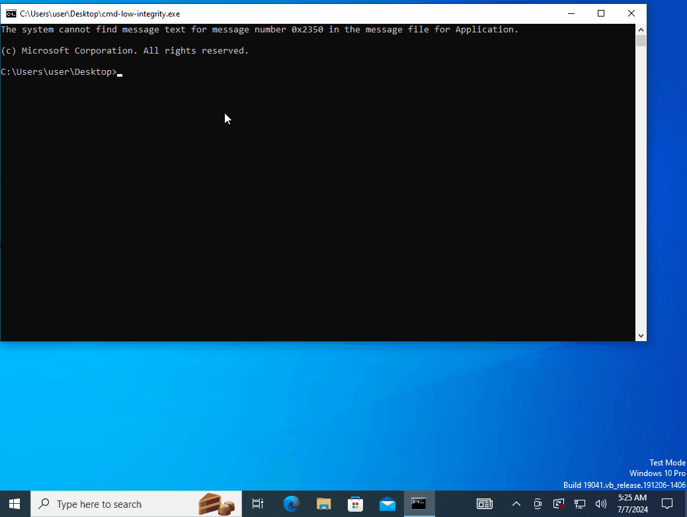

# HackSys Extreme Vulnerable Driver (HEVD) - BufferOverflowNonPagedPoolNx Exploit

## Introduction

This repository contains an exploit for the BufferOverflowNonPagedPoolNx vulnerability in [HackSys Extreme Vulnerable Driver (HEVD)](https://github.com/hacksysteam/HackSysExtremeVulnerableDriver). The exploit targets Windows 10 Version 22H2 (OS Build 19045.3930) and demonstrates a technique to achieve privilege escalation from a low-integrity process to SYSTEM.

## Exploit Overview

The exploit leverages [a buffer overflow vulnerability in the NonPagedPoolNx](https://github.com/hacksysteam/HackSysExtremeVulnerableDriver/blob/b02b6ea3/Driver/HEVD/Windows/BufferOverflowNonPagedPoolNx.c#L138) to achieve arbitrary read/write primitives. It then uses these primitives to elevate privileges by modifying the process token.

Key steps in the exploit:

1. [Establish arbitrary read primitive](https://github.com/ommadawn46/HEVD-BufferOverflowNonPagedPoolNx-Win10-22H2/blob/4459a76/HEVD-BufferOverflowNonPagedPoolNx-Win10-22H2/src/primitives/arbitrary_read.cpp#L163):
   - Exploit HEVD's NonPagedPoolNx buffer overflow to corrupt an adjacent chunk's POOL_HEADER, creating a ["ghost chunk"](https://www.sstic.org/media/SSTIC2020/SSTIC-actes/pool_overflow_exploitation_since_windows_10_19h1/SSTIC2020-Slides-pool_overflow_exploitation_since_windows_10_19h1-bayet_fariello.pdf#page=43).
   - Overwrite the previous chunk with a fake PipeQueueEntry, manipulating the ghost chunk's PipeQueueEntry structure.
   - Set the manipulated linkedIRP to point to a user-mode fake PipeQuerySub structure.
   - Set PipeQuerySub's data_ptr to the desired read address.
   - Use PeekNamedPipe to trigger a read from the address specified in data_ptr.

2. [Leak kernel information](https://github.com/ommadawn46/HEVD-BufferOverflowNonPagedPoolNx-Win10-22H2/blob/4459a76/HEVD-BufferOverflowNonPagedPoolNx-Win10-22H2/src/core/privilege_escalation.cpp#L14):
   - Use the arbitrary read primitive to obtain kernel base address, ExpPoolQuotaCookie, and other critical addresses.
   - Find the EPROCESS structure of the current process.

3. [Establish arbitrary decrement primitive](https://github.com/ommadawn46/HEVD-BufferOverflowNonPagedPoolNx-Win10-22H2/blob/4459a76/HEVD-BufferOverflowNonPagedPoolNx-Win10-22H2/src/primitives/arbitrary_decrement.cpp#L56):
   - Create a fake EPROCESS structure in kernel land using a pipe attribute.
   - Manipulate the POOL_HEADER of the ghost chunk to set the PoolQuota bit.
   - Craft a fake ProcessBilled pointer in the POOL_HEADER, using the leaked ExpPoolQuotaCookie.
   - Trigger the free of the ghost chunk to cause an arbitrary decrement at a controlled address.

4. [Establish arbitrary write primitive](https://github.com/ommadawn46/HEVD-BufferOverflowNonPagedPoolNx-Win10-22H2/blob/4459a76/HEVD-BufferOverflowNonPagedPoolNx-Win10-22H2/src/primitives/arbitrary_write.cpp#L12):
   - Use the arbitrary decrement capability to manipulate the PreviousMode field of the current thread's KTHREAD structure.
   - This manipulation enables arbitrary write capabilities in kernel mode.

5. [Elevate privileges (data-only attack)](https://github.com/ommadawn46/HEVD-BufferOverflowNonPagedPoolNx-Win10-22H2/blob/4459a76/HEVD-BufferOverflowNonPagedPoolNx-Win10-22H2/src/core/privilege_escalation.cpp#L157):
   - Use the arbitrary read primitive to locate the System process EPROCESS structure.
   - Use the arbitrary write primitive to copy the System process token to the current process's token.

6. [Restore kernel state](https://github.com/ommadawn46/HEVD-BufferOverflowNonPagedPoolNx-Win10-22H2/blob/4459a76/HEVD-BufferOverflowNonPagedPoolNx-Win10-22H2/src/core/cleanup.cpp#L74):
   - Fix manipulated pool structures to avoid crashes.
   - Use the arbitrary write primitive to restore PreviousMode to its original value.

## Tested Environment

This exploit was tested in the following environment:

- Windows 10 Version 22H2 (OS Build 19045.3930)
- KVA Shadow: Enabled
- VBS/HVCI: Disabled
- Integrity Level: Low

## Demo



## Build

To build the project:

1. Open the solution file `HEVD-BufferOverflowNonPagedPoolNx-Win10-22H2.sln` in Visual Studio 2022.
2. Build the solution (F7 or Build > Build Solution).

## Usage

1. Load the HEVD driver on the target system.

2. Start a Low Integrity command prompt:
   ```
   copy %systemroot%\system32\cmd.exe .\cmd-low-integrity.exe
   icacls .\cmd-low-integrity.exe /setintegritylevel low
   .\cmd-low-integrity.exe
   ```
   Verify the integrity level:
   ```
   whoami /groups | find "Mandatory Label"
   ```
   This should show "Mandatory Label\Low Mandatory Level".

3. From the Low Integrity command prompt, run the compiled exploit.

4. If successful, a SYSTEM shell should spawn.

## Disclaimer

This code is provided for educational purposes only. Use it responsibly and only on systems you have permission to test.

## References

- [Bayet, C., & Fariello, P. (2020). Scoop the Windows 10 pool!](https://www.sstic.org/media/SSTIC2020/SSTIC-actes/pool_overflow_exploitation_since_windows_10_19h1/SSTIC2020-Article-pool_overflow_exploitation_since_windows_10_19h1-bayet_fariello.pdf)
- [synacktiv/Windows-kernel-SegmentHeap-Aligned-Chunk-Confusion](https://github.com/synacktiv/Windows-kernel-SegmentHeap-Aligned-Chunk-Confusion)
- [cbayet/Exploit-CVE-2017-6008](https://github.com/cbayet/Exploit-CVE-2017-6008)
