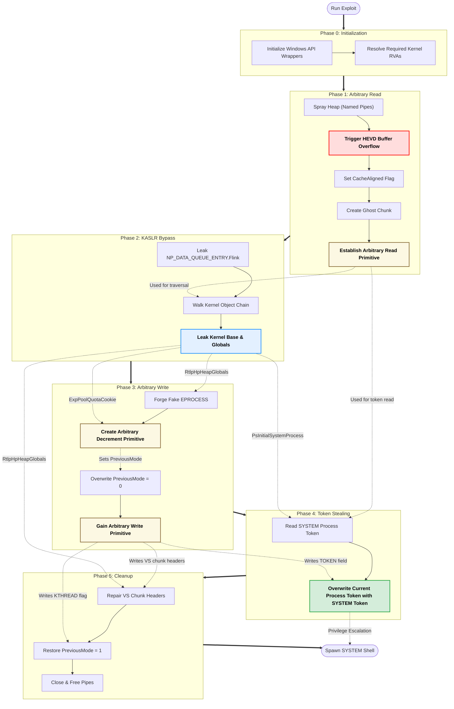

# HackSys Extreme Vulnerable Driver (HEVD) - BufferOverflowNonPagedPoolNx Exploit

## Introduction

This repository contains an exploit for the BufferOverflowNonPagedPoolNx vulnerability in [HackSys Extreme Vulnerable Driver (HEVD)](https://github.com/hacksysteam/HackSysExtremeVulnerableDriver). The exploit targets Windows 10 Version 22H2 and demonstrates a technique to achieve privilege escalation from a low-integrity process to SYSTEM.

This exploit uses runtime analysis of kernel modules to work across multiple Windows 10 22H2 builds.

## Exploit Overview

The exploit leverages [the BufferOverflowNonPagedPoolNx vulnerability](https://github.com/hacksysteam/HackSysExtremeVulnerableDriver/blob/b02b6ea3/Driver/HEVD/Windows/BufferOverflowNonPagedPoolNx.c#L138) to create a ["ghost chunk"](https://www.sstic.org/media/SSTIC2020/SSTIC-actes/pool_overflow_exploitation_since_windows_10_19h1/SSTIC2020-Slides-pool_overflow_exploitation_since_windows_10_19h1-bayet_fariello.pdf#page=43) through [Aligned Chunk Confusion](https://github.com/synacktiv/Windows-kernel-SegmentHeap-Aligned-Chunk-Confusion) in the NonPagedPoolNx region. This ghost chunk is then manipulated to achieve arbitrary read and write primitives, which are subsequently used to elevate privileges.

**Key techniques:**

1. Dynamic discovery of kernel offsets by analyzing PE binary formats of system modules (ntoskrnl.exe and npfs.sys), providing compatibility across multiple Windows builds without requiring version-specific memory offsets.

2. Creation of a ghost chunk using Aligned Chunk Confusion in NonPagedPoolNx, enabling leakage and manipulation of [HEAP_VS_CHUNK_HEADER](https://www.vergiliusproject.com/kernels/x64/windows-10/22h2/_HEAP_VS_CHUNK_HEADER), [POOL_HEADER](https://www.vergiliusproject.com/kernels/x64/windows-10/22h2/_POOL_HEADER), and [NP_DATA_QUEUE_ENTRY](https://github.com/ommadawn46/HEVD-BufferOverflowNonPagedPoolNx-Win10-22H2/blob/7aeb8ed/HEVD-BufferOverflowNonPagedPoolNx-Win10-22H2/include/common.h#L83) structures via the previous chunk.

3. Establishment of an arbitrary read primitive by manipulating the NP_DATA_QUEUE_ENTRY structure within the ghost chunk to set up a fake [IRP](https://github.com/ommadawn46/HEVD-BufferOverflowNonPagedPoolNx-Win10-22H2/blob/7aeb8ed/HEVD-BufferOverflowNonPagedPoolNx-Win10-22H2/include/common.h#L97).

4. Bypass KASLR by leaking an initial kernel address from NP_DATA_QUEUE_ENTRY.QueueEntry.Flink. This leaked address allows traversing linked kernel structures to determine the kernel base address.

5. Establishment of an arbitrary decrement primitive by altering the POOL_HEADER structure within the ghost chunk to set a fake ProcessBilled.

6. Establishment of an arbitrary write primitive by zeroing the [PreviousMode](https://learn.microsoft.com/en-us/windows-hardware/drivers/kernel/previousmode) in the current thread's [KTHREAD](https://www.vergiliusproject.com/kernels/x64/windows-10/22h2/_KTHREAD) structure.

7. Elevation to SYSTEM privileges by modifying the Token in the current process's [EPROCESS](https://www.vergiliusproject.com/kernels/x64/windows-10/22h2/_EPROCESS) structure.

8. Stabilization of the system and avoidance of BSoD by manipulating the HEAP_VS_CHUNK_HEADER structures of the ghost chunk and its linked chunks to prevent detection of the corrupted chunk.

### Exploit Execution Flow



## Tested Environment

This exploit was tested in the following environments:

- Windows 10 Version 22H2
  - OS Build 19045.5737
  - OS Build 19045.5247
  - OS Build 19045.4651
  - OS Build 19045.3930
- KVA Shadow: Enabled
- VBS/HVCI: Disabled
- Integrity Level: Low

> **Note:** Due to the exploit's dynamic PE analysis approach, it may work on additional Windows 10 Version 22H2 builds beyond those explicitly tested.

## Demo


## How to Run

### Step 1: Install HEVD Driver

1. Download and extract [the precompiled driver](https://github.com/hacksysteam/HackSysExtremeVulnerableDriver/releases):

   ```cmd
   mkdir C:\temp
   powershell -Command "Invoke-WebRequest https://github.com/hacksysteam/HackSysExtremeVulnerableDriver/releases/download/v3.00/HEVD.3.00.zip -OutFile C:\temp\HEVD.3.00.zip"
   powershell -Command "Expand-Archive -Path C:\temp\HEVD.3.00.zip -DestinationPath C:\temp\HEVD -Force"
   ```

2. Place `HEVD.sys` in your desired directory:

   ```cmd
   copy C:\temp\HEVD\driver\vulnerable\x64\HEVD.sys C:\Windows\System32\drivers\HEVD.sys
   ```

3. Enable Test Signing Mode (reboot required):

   ```cmd
   bcdedit /set testsigning on
   shutdown /r /t 0
   ```

4. Create and start the driver service:

   ```cmd
   sc create HEVD type= kernel binPath= "C:\Windows\System32\drivers\HEVD.sys" start= auto
   sc start HEVD
   ```

### Step 2: Build the Exploit

To build the project:

1. Open the solution file `HEVD-BufferOverflowNonPagedPoolNx-Win10-22H2.sln` in Visual Studio 2022.
2. Build the solution (F7 or Build > Build Solution).

### Step 3: Prepare Low Integrity Environment

1. Start a Low Integrity command prompt:
   ```
   copy %systemroot%\system32\cmd.exe .\cmd-low-integrity.exe
   icacls .\cmd-low-integrity.exe /setintegritylevel low
   .\cmd-low-integrity.exe
   ```

2. Verify the integrity level:
   ```
   whoami /groups | find "Mandatory Label"
   ```
   This should show "Mandatory Label\Low Mandatory Level".

### Step 4: Run the Exploit

- From the Low Integrity command prompt, run the compiled exploit.

   ```
   .\HEVD-BufferOverflowNonPagedPoolNx-Win10-22H2.exe
   ```

- If successful, a SYSTEM shell should spawn.

### (Optional) Step 5: Setup Kernel Debugging

#### Host Setup (Debugger)

1. Install WinDbg from the Microsoft Store:
   - [WinDbg (Microsoft Store)](https://apps.microsoft.com/detail/9pgjgd53tn86)

2. Launch WinDbg from the Start menu and configure the kernel debugging connection:
   - Click **File** > **Attach to Kernel** > **Net**.
   - Enter a **port number** and a **unique key** of your choice. You will later specify the same `<PORT>` and `<KEY>` on the target system using `bcdedit /dbgsettings`.
   - Click **OK** to start listening for the debuggee's connection.

#### Target Setup (Debuggee)

Use the following commands on the target system, replacing:

- `<DEBUGGER_IP>` with the IP address of the host machine running WinDbg
- `<PORT>` with the same port number you entered in WinDbg
- `<KEY>` with the same key you entered in WinDbg

```cmd
bcdedit /debug {default} on
bcdedit /dbgsettings net hostip:<DEBUGGER_IP> port:<PORT> key:<KEY>
shutdown /r /t 0
```

Once the target system reboots, it will attempt to connect to the debugger over the network.

## Detailed Exploit Steps

1. **Dynamic discovery of kernel addresses** - [ResolveKernelRvas() in `pe_utils.cpp`](https://github.com/ommadawn46/HEVD-BufferOverflowNonPagedPoolNx-Win10-22H2/blob/main/HEVD-BufferOverflowNonPagedPoolNx-Win10-22H2/src/pe_utils/pe_utils.cpp)
   - The exploit analyzes PE headers of kernel modules (ntoskrnl.exe and npfs.sys) to calculate offsets.
   - It resolves critical RVAs (Relative Virtual Addresses) for kernel functions and variables.
   - The exploit loads modules locally using LoadLibraryExA with DONT_RESOLVE_DLL_REFERENCES flag.
   - It parses PE headers to locate exported functions (ExAllocatePoolWithTag), global variables (PsInitialSystemProcess), and imports.
   - This approach provides compatibility across different Windows builds without hardcoded offsets.

2. **Create a ghost chunk** - [SetupArbitraryRead() in `arbitrary_read.cpp`](https://github.com/ommadawn46/HEVD-BufferOverflowNonPagedPoolNx-Win10-22H2/blob/main/HEVD-BufferOverflowNonPagedPoolNx-Win10-22H2/src/primitives/arbitrary_read.cpp)
   - Create holes in the NonPagedPoolNx by allocating and selectively freeing pipe buffers.
   - Spray the heap with pipes to create a predictable layout before triggering the vulnerability.
   - Enable the dynamic lookaside list for the ghost chunk size.
     - When the corrupted chunk is freed and placed onto the lookaside list, this defers its processing by the Variable Size (VS) heap backend's main free path (e.g., coalescing checks).
     - This delay mechanism is employed to prevent immediate detection of the heap corruption and avoid a crash (BSOD).
   - Trigger HEVD's buffer overflow to corrupt an adjacent chunk's POOL_HEADER:
     - Set CacheAligned bit (0x4) and manipulate PreviousSize to control chunk positioning.
   - Upon freeing and reallocating, this creates a ghost chunk overlapping with a previous chunk.
   - The ghost chunk's HEAP_VS_CHUNK_HEADER, POOL_HEADER, and NP_DATA_QUEUE_ENTRY overlap with the previous chunk's data.

3. **Establish arbitrary read primitive** - [ArbitraryRead() in `arbitrary_read.cpp`](https://github.com/ommadawn46/HEVD-BufferOverflowNonPagedPoolNx-Win10-22H2/blob/main/HEVD-BufferOverflowNonPagedPoolNx-Win10-22H2/src/primitives/arbitrary_read.cpp)
   - Create a user-mode fake IRP structure with a controllable SystemBuffer field.
   - Write to the previous chunk to overwrite the ghost chunk's NP_DATA_QUEUE_ENTRY.
   - Point the Irp field of NP_DATA_QUEUE_ENTRY to the user-mode fake IRP
   - Set NP_DATA_QUEUE_ENTRY.DataEntryType to 0x1 (Unbuffered).
     - With DataEntryType=1 (Unbuffered), the kernel reads from the address pointed to by IRP->SystemBuffer.
     - In contrast, DataEntryType=0 (Buffered) would make the kernel read from NP_DATA_QUEUE_ENTRY's data array.
   - Set fake IRP's SystemBuffer to the desired read address.
   - Use PeekNamedPipe to trigger a read from the specified kernel memory address.
   - Reading from the previous chunk's PipeQueue leaks data from the target address.

4. **KASLR bypass & Leak kernel information** - [leakKernelInfo() in `privilege_escalation.cpp`](https://github.com/ommadawn46/HEVD-BufferOverflowNonPagedPoolNx-Win10-22H2/blob/main/HEVD-BufferOverflowNonPagedPoolNx-Win10-22H2/src/core/privilege_escalation.cpp)
   - Use arbitrary read to leak NP_DATA_QUEUE_ENTRY.QueueEntry.Flink pointer, which points to NP_CCB.DataQueue.
   - This first kernel-mode address leak is the critical step that defeats KASLR.
   - Traverse the object chain using the arbitrary read primitive:
      - NP_CCB.FileObject -> FILE_OBJECT
      - FILE_OBJECT -> DEVICE_OBJECT
      - DEVICE_OBJECT -> DRIVER_OBJECT
      - DRIVER_OBJECT -> npfs.sys base address
   - Read ExAllocatePoolWithTag address from npfs.sys's import table.
   - Calculate ntoskrnl.exe base address by subtracting the RVA of ExAllocatePoolWithTag.
   - Using the arbitrary read primitive, obtain additional critical addresses:
     - ExpPoolQuotaCookie, RtlpHpHeapGlobals, PsInitialSystemProcess.
     - Locate current process EPROCESS and KTHREAD structures.

5. **Establish arbitrary decrement primitive** - [SetupArbitraryDecrement() in `arbitrary_decrement.cpp`](https://github.com/ommadawn46/HEVD-BufferOverflowNonPagedPoolNx-Win10-22H2/blob/main/HEVD-BufferOverflowNonPagedPoolNx-Win10-22H2/src/primitives/arbitrary_decrement.cpp)
   - Create a fake EPROCESS structure in NonPagedPoolNx by writing data to the pipe associated with the previous chunk.
   - Modify the ghost chunk's POOL_HEADER by reallocating the previous chunk:
     - Set the PoolQuota bit to make the kernel interpret part of the header as a ProcessBilled pointer.
     - Configure a fake ProcessBilled pointer using the formula:
       `ProcessBilled = fake EPROCESS address ⊕ Ghost Chunk address ⊕ ExpPoolQuotaCookie`
     - Set up the fake EPROCESS structure with its PoolQuotaBlock pointing to (target address - 1).
     - Set the BlockSize to 0x100 bytes.
   - Trigger the freeing of the ghost chunk, causing the kernel to:
     - Subtract 0x100 (BlockSize) from the PoolQuota at (target address - 1).
     - This results in a decrement of 0x1 at the target address.

6. **Establish arbitrary write primitive** - [SetupArbitraryWrite() in `arbitrary_write.cpp`](https://github.com/ommadawn46/HEVD-BufferOverflowNonPagedPoolNx-Win10-22H2/blob/main/HEVD-BufferOverflowNonPagedPoolNx-Win10-22H2/src/primitives/arbitrary_write.cpp)
   - Use the arbitrary decrement primitive to manipulate the PreviousMode field of the current thread's KTHREAD structure.
     - Decrement PreviousMode from 1 (UserMode) to 0 (KernelMode).
   - This manipulation bypasses address validation in native system service routines like NtWriteVirtualMemory:
     - Normally, these routines perform checks to prevent writing to kernel space addresses when called from user mode.
     - With PreviousMode set to KernelMode, these checks are skipped.
   - As a result, the exploit gains the ability to write to arbitrary kernel memory addresses, establishing an arbitrary write primitive.

7. **Elevate privileges (data-only attack)** - [EscalatePrivileges() in `privilege_escalation.cpp`](https://github.com/ommadawn46/HEVD-BufferOverflowNonPagedPoolNx-Win10-22H2/blob/main/HEVD-BufferOverflowNonPagedPoolNx-Win10-22H2/src/core/privilege_escalation.cpp)
   - Use the arbitrary read primitive to locate the System process EPROCESS structure.
   - Use the arbitrary write primitive to copy the System process token to the current process's token.

8. **Restore kernel state** - [FixVsChunkHeaders(), RestorePreviousMode() and CleanupPipes() in `cleanup.cpp`](https://github.com/ommadawn46/HEVD-BufferOverflowNonPagedPoolNx-Win10-22H2/blob/main/HEVD-BufferOverflowNonPagedPoolNx-Win10-22H2/src/core/cleanup.cpp)
   - Repair the HEAP_VS_CHUNK_HEADER structures of the ghost chunk and adjacent chunks:
     - Use RtlpHpHeapGlobals (previously leaked) to decode and re-encode headers:
       - `decodedVsHeader = encodedVsHeader ⊕ addrof(encodedVsHeader) ⊕ RtlpHpHeapGlobals`
     - Update UnsafeSize and UnsafePrevSize to restore proper chunk linkage.
     - These repairs prevent detection of the corrupted heap structure, avoiding [KERNEL MODE HEAP CORRUPTION](https://learn.microsoft.com/windows-hardware/drivers/debugger/bug-check-0x13a--kernel-mode-heap-corruption) and subsequent BSoD.
   - Restore PreviousMode to its original value of 1 (UserMode).
   - Clean up the pipes used in the exploit.

## Disclaimer

This code is provided for educational purposes only. Use it responsibly and only on systems you have permission to test.

## References

- [synacktiv/Windows-kernel-SegmentHeap-Aligned-Chunk-Confusion](https://github.com/synacktiv/Windows-kernel-SegmentHeap-Aligned-Chunk-Confusion)
- [cbayet/Exploit-CVE-2017-6008](https://github.com/cbayet/Exploit-CVE-2017-6008)
